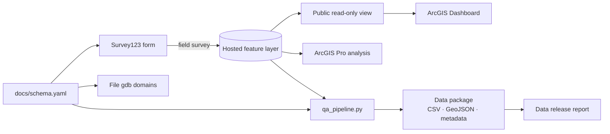

# Whatcom Creek Salmon Monitoring Pipeline

> **Status: in progress.** Field survey 1: Oct 5, 2026. Sections marked _TBD_ get filled in as each component ships.

An end-to-end field-to-dashboard ecological monitoring workflow built in ArcGIS: a fall salmon spawner survey on Whatcom Creek (Bellingham, WA), taken from Survey123 field collection through QA/QC, geodatabase, ArcGIS Pro analysis, a public dashboard, and a documented open data release.



## Links
| Component | Link |
|---|---|
| ArcGIS Dashboard | https://crasmussen.maps.arcgis.com/apps/dashboards/081b7ffec5a541a887000364ada89df3 |
| Observations (public read-only REST) | https://services8.arcgis.com/sCQffpewzLxvlPPV/arcgis/rest/services/whatcom_salmon_obs_public/FeatureServer |
| Index stations (REST) | https://services8.arcgis.com/sCQffpewzLxvlPPV/arcgis/rest/services/whatcom_stations/FeatureServer |
| Survey123 form | Screenshots in `screenshots/form_*.png` (form not public; it writes to the live dataset) |
| Map layout (PDF) | _TBD_ |
| Data release report | _TBD_ |

## Background
Whatcom Creek runs about 4 miles from the Lake Whatcom outlet, through Whatcom Falls Park and downtown Bellingham, to Bellingham Bay. It supports a long-running hatchery return of fall chum and, more recently, a supplemented September chinook run, plus coho. Two natural features shape where fish can go:

- **Lower falls at Maritime Heritage Park:** a partial barrier. Most of the hatchery return stops below it, though small numbers of chinook get past ([Cascadia Daily News, 2023](https://www.cascadiadaily.com/2023/sep/29/those-whatcom-creek-salmon-are-supposed-to-die/)).
- **Whatcom Falls (Whatcom Falls Park):** the upstream limit for anadromous fish. Above it, the creek holds resident cutthroat trout and kokanee ([City of Bellingham](https://iframe.cob.org/gov/public/bc/parks/Lists/materials/Attachments/229/A%20HEALTHIER%20WHATCOM%20CREEK%20(1)-R1.pdf)).

WDFW [SalmonScape](https://apps.wdfw.wa.gov/salmonscape/map.html) documents fall chum spawning from Maritime Heritage Park through downtown, fall chinook spawning from roughly Racine St to Woburn St, and documented presence of chum, chinook, and coho up to Whatcom Falls Park. No anadromous distribution is mapped above the falls (`screenshots/salmonscape_*.png`).

**Absences are data.** Every station visit produces at least one record. A "no fish seen" record is a measured zero, not missing data, and early-October visits come before the chum peak. Above Whatcom Falls, zeros are the expected result, which makes R4 a reference reach.

## Repository layout
```
docs/schema.yaml     canonical data model: fields, domains, rules, QA flag codes
form/                Survey123 XLSForm (generated from the schema)
scripts/             build_xlsform.py · make_gdb_domains.py · qa_pipeline.py · publish_surveys.ipynb
data/raw/            raw exports from the hosted layer
data/release/        QA'd open data package
report/              Quarto data release report
tests/               synthetic-data tests for the QA checks
screenshots/         form, field, SalmonScape, and dashboard images
docs/plan.md         original project plan
```

## Design: one schema, everything generated
Every field, coded domain, validation rule, and QA flag is defined once in `docs/schema.yaml`. The Survey123 form, the geodatabase domains, the QA checks, and the data dictionary are all generated from it, so field data and the database can't drift apart.

## Methods
**Reaches.** Four reaches numbered upstream from the mouth, split at fixed landmarks (`whatcom_reaches`):

| Reach | Extent | Approx. length | Context |
|---|---|---|---|
| R1 | Mouth → Maritime Heritage Park | 0.4 km | Tidal; below the lower falls |
| R2 | Maritime Heritage Park → Woburn St | 3.3 km | Documented chum and chinook spawning |
| R3 | Woburn St → WWU fisheries rental | 1.9 km | Contains Whatcom Falls (anadromous limit) |
| R4 | WWU rental → Lake Whatcom outlet | 1.1 km | Above the anadromous limit; reference reach |

**Index stations.** Five fixed stations (`whatcom_stations`): R1-S1 Holly St bridge, R2-S1 Meador bridge, R2-S2 Woburn St bridge, R3-S1 Whatcom Falls Park, R4-S1 Electric Ave bridge. The long R2 reach gets two. A station on a boundary landmark belongs to the reach downstream of it.

**Field protocol.** At each station: a 10-minute timed visual scan from the bank or bridge. One Survey123 record per observation (live fish, carcass, redd, or habitat feature). If nothing is seen, one "no fish seen" record. The station code starts the notes field (e.g. `STN R2-S2 · 10 min scan`). Water clarity and flow are recorded on every record and checked for consistency within a visit. Observers stay on banks, bridges, and trails, keep off and away from redds, and don't handle fish or carcasses.

**Collection.** Survey123 form generated from the schema and published from an ArcGIS Online Notebook (no Survey123 Connect). It has coded domains, conditional fields (species only for fish, carcass, and redd records; count vs. redd count by observation type), range constraints, a no-future-dates rule, and a two-tier GPS check: the form blocks fixes worse than 50 m, and QA flags anything over 15 m. Validation tested on device (`screenshots/form_*.png`).

**QA/QC.** Form-level validation at entry, plus a post-collection script that flags (never deletes) missing, out-of-range, not-applicable, off-domain, out-of-window, low-accuracy, duplicate, and within-visit-inconsistent records. Results are written to `qa_flag`. _TBD: QA summary from survey 1._

**Publishing.** The dashboard reads a read-only hosted view, so the public can query the data but not edit it. The source layer stays private.

**Analysis.** _TBD: LiDAR slope → mean gradient per reach, spatial join summaries, WDFW fish passage and SalmonScape overlays._

## Results
_TBD: survey dates, counts by reach and species, QA summary, map._

## Reproduce
```bash
pip install -r requirements.txt
python scripts/build_xlsform.py docs/schema.yaml form/whatcom_salmon.xlsx      # regenerate form
python scripts/qa_pipeline.py --schema docs/schema.yaml --item <ITEM_ID> --out data/release
cd report && quarto render data_release_report.qmd
pytest tests/                                                                  # QA check tests
```
`make_gdb_domains.py` runs in the ArcGIS Pro Python environment (needs `arcpy`). `scripts/publish_surveys.ipynb` runs in an ArcGIS Online Notebook and republishes the form from the repo.

## Limitations
- Single observer, visual counts only. Index stations sample the creek; they aren't a full census.
- Short season window so far (survey 1 falls before the chum peak). Flow and clarity are qualitative.
- Station codes live in the notes field rather than a dedicated field. A `station` field is the next schema change.
- R1 is tidal, which lowers visibility at some tide stages.
- _TBD: anything learned in the field._

## Troubleshooting notes
- **Public view shows no records:** Survey123 sets the source layer's anonymous access to "add only," and public views inherit it, so logged-out queries return 0. Fix it on the source layer: Settings → editors can see all features, and anonymous access the same as signed-in editors. The source stays unshared and the view stays read-only.

## License
Code: MIT (see `LICENSE`). Data in `data/release/`: CC BY 4.0.
