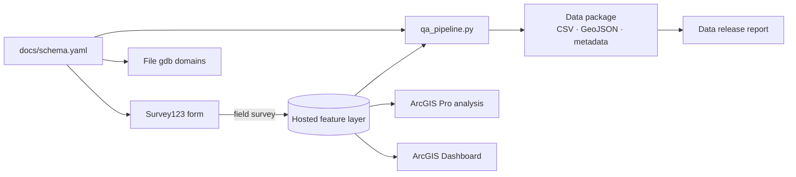

# Whatcom Creek Salmon Monitoring Pipeline

> **Status: in progress (build window Oct 1–5, 2026).** Sections marked _TBD_ get filled in as each component ships.

An end-to-end field-to-dashboard ecological monitoring workflow built in ArcGIS: a fall salmon spawner survey on Whatcom Creek (Bellingham, WA), taken from Survey123 field collection through QA/QC, geodatabase, ArcGIS Pro analysis, a public dashboard, and a documented open data release.



## Links
| Component | Link |
|---|---|
| Survey123 form | _TBD_ |
| ArcGIS Dashboard | _TBD_ |
| Map layout (PDF) | _TBD_ |
| Data release report | _TBD_ |

## Background
_TBD: chum/coho spawning on Whatcom Creek, why spawner surveys matter, and why absences (zero counts) are recorded._

## Repository layout
```
docs/schema.yaml     canonical data model: fields, domains, rules, QA flag codes
form/                Survey123 XLSForm (generated from the schema)
scripts/             build_xlsform.py · make_gdb_domains.py · qa_pipeline.py
data/raw/            raw exports from the hosted layer
data/release/        QA'd open data package
report/              Quarto data release report
tests/               synthetic-data tests for the QA checks
screenshots/         form, field, and dashboard images
docs/plan.md         original project plan
```

## Design: one schema, everything generated
Every field, coded domain, validation rule, and QA flag is defined once in `docs/schema.yaml`. The Survey123 form, the geodatabase domains, the QA checks, and the data dictionary are all generated from it, so field data and the database can't drift apart.

## Methods
**Survey design.** _TBD: reaches and landmarks, walk protocol, visual counts from the bank._
**Collection.** Survey123 form with coded domains, conditional required fields (e.g. species only for fish/carcass/redd records), range constraints, and a 15 m GPS accuracy threshold.
**QA/QC.** Form-level validation at entry, plus a post-collection script that flags (never deletes) missing, out-of-range, not-applicable, off-domain, out-of-window, low-accuracy, duplicate, and within-visit-inconsistent records.
**Analysis.** _TBD: LiDAR slope → mean gradient per reach, spatial join summaries, WDFW fish passage and SalmonScape overlays._

## Reproduce
```bash
pip install -r requirements.txt
python scripts/build_xlsform.py docs/schema.yaml form/whatcom_salmon.xlsx      # regenerate form
python scripts/qa_pipeline.py --schema docs/schema.yaml --item <ITEM_ID> --out data/release
cd report && quarto render data_release_report.qmd
pytest tests/                                                                  # QA check tests
```
`make_gdb_domains.py` runs in the ArcGIS Pro Python environment (needs `arcpy`).

## Limitations
_TBD: single observer, visual counts only, short season window, qualitative flow._

## License
Code: MIT (see `LICENSE`). Data in `data/release/`: CC BY 4.0.
